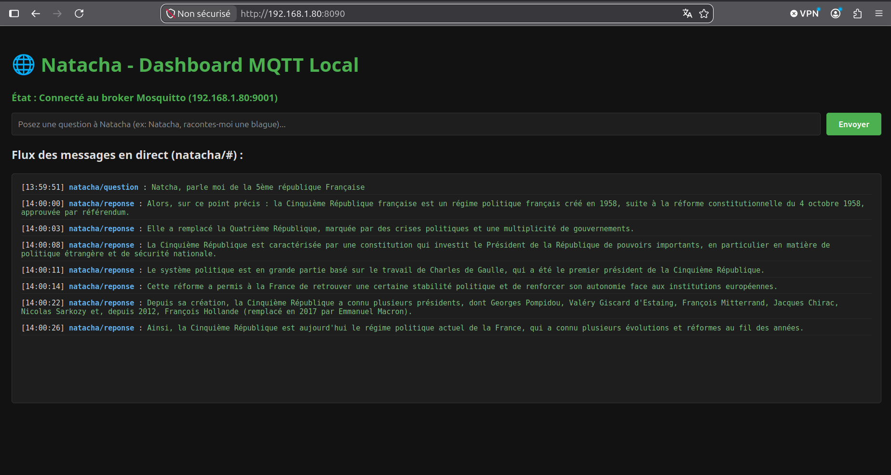
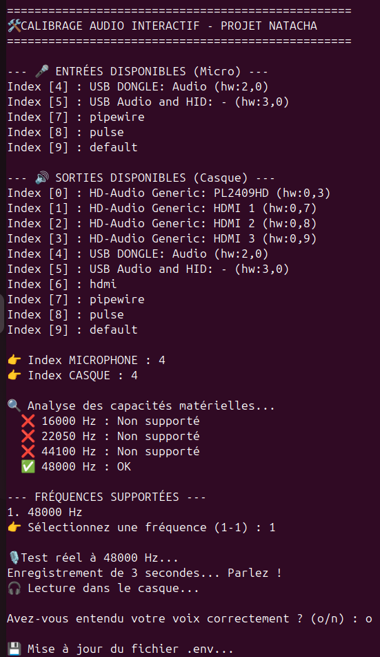

# -Projet-Natacha-Cluster-IA-Distribu-Multi-Backend


Natacha est un assistant personnel modulaire conçu pour fonctionner sur un cluster de machines hétérogènes. Contrairement aux solutions monolithiques, Natacha fragmente l'intelligence (Cerveau, Oreille, Bouche, Dashboard et Serveur de Communication/Savoir) pour exploiter le meilleur de chaque architecture matérielle (Intel Core, AMD Ryzen, Rockchip SBC). 

### Comment utiliser Natacha ?

​Le système dispose d'un micro-casque USB sans fil pour échanger vocalement avec Natacha. Chaque interaction s'amorce par le mot-clé d'appel, suivi de votre demande.

​1. Interroger les connaissances générales du modèle
Posez une question dont la réponse est puisée directement dans les données internes du modèle :
​"Natacha, pourquoi le ciel est bleu ?"

​2. Consulter la base de connaissances Kiwix
Demandez à Natacha de chercher de l'information hors ligne (hébergée sur le serveur dédié) :
​"Natacha, lis-moi un article Kiwix sur l'intrication quantique." 

*​Note : Au lieu de lire brutalement les résultats bruts de la recherche, Natacha synthétise et résume le contenu pour vous.*

​3. Interroger la base relationnelle (ChromaDB)
Accédez aux informations personnelles ou contextuelles préalablement enregistrées :
​"Natacha, qui est Thierry Vieil ?"

​4. Suivre l'actualité
Natacha interroge périodiquement une dizaine de flux RSS et les stocke dans sa base de données locale :
​"Natacha, parle-moi de l'actualité du dimanche 9 août 2026."

*​Note : Là encore, Natacha évite la simple restitution brute et vous propose un résumé synthétique de l'information disponible.*

### Comment ​enregistrer une nouvelle information?

​Pour alimenter la base de données relationnelle ChromaDB par la voix, formulez simplement votre phrase d'enregistrement :
​"Natacha, Enregistre que Thierry Vieil est né à Lille."

​Si vous posez ultérieurement la question "Natacha Où est né Thierry Vieil ?", Natacha sera en mesure de retrouver la réponse dans sa base ChromaDB.

### Comment faire un diagnostic de Natacha?

"Natacha, analyse fonctionnement Natacha"

### Comment redémarrer les services de Natacha?

"Natacha, redémarrage des services Natacha"

### Comment arrêter complètement Natacha?

"Natacha, arrêt complet assistante Natacha"


&nbsp;
Démonstration :
[](https://youtube.com/watch?v=ivVGWKrNOFM&is=CzzSoqOgiRcdu8HI)

https://youtube.com/watch?v=ivVGWKrNOFM&is=WevjTCej9jadv8qc


​🏗️ Architecture du Système

​Le projet repose sur une communication distribuée et hybride :

​MQTT (Broker centralisé) : Pour la logique de contrôle, le routage des messages et les échanges de texte.

​UDP / GStreamer : Pour le transport audio basse latence entre les nœuds.


​Les Piliers du Cluster

​L'Oreille (Transcription) : Capture audio et conversion STT (Speech-To-Text) via Faster-Whisper.

​Le Cerveau (Inférence) : LLM local (`llama.cpp`) pour le raisonnement, la gestion des commandes et ChromaDB.

​La Bouche (Synthèse Vocale) : `XTTS v2` sous PyTorch/CUDA pour une synthèse vocale ultra-réaliste avec clonage de voix et sortie audio physique.

​Natacha - Dashboard : Interface de supervision et de monitoring temps réel de l'état de santé du cluster et des flux MQTT.



​Serveur de Communication & Savoir : Nœud hébergeant le broker MQTT (`Mosquitto`) et le serveur de connaissances hors-ligne (`Kiwix`).

&nbsp;

🚀 Compatibilité Matérielle (Multi-Backend)

Le projet utilise les accélérateurs matériels disponibles :

| Hardware | Backend Accelerators | Utilisation Optimale |
| :--- | :--- | :--- |
| **Intel ULTRA** | Core Ultra 9 285H / 16Go RAM | Cerveau (Inférence LLM ultra-rapide) |
| **Intel Core** | Intel Core i5 14th gen (AVX-512) / 32 Go RAM | Oreille (medium-Whisper STT) |
| **Intel Core** | Intel Core i9 9880H / GTX 1650 4Go (CUDA) / 16 Go RAM | Bouche (`XTTS v2` - Synthèse Vocale) |
| **AMD Ryzen 7 5800U** | Mosquitto MQTT & Kiwix-serve | Communication & Base Documentaire ZIM |

&nbsp;

# 🛠️ Installation & Déploiement

📋 Prérequis Système

Le projet Natacha est développé et optimisé pour Ubuntu 24.04 LTS. L'utilisation de cette version garantit la stabilité des flux audio et la gestion correcte des environnements Conda.

### 1. Installation de Miniconda3 (Commun à tous les nœuds)

Si Miniconda n'est pas encore présent sur votre système :

## Pour un PC classique (Intel/AMD) :
```bash
wget [https://repo.anaconda.com/miniconda/Miniconda3-latest-Linux-x86_64.sh](https://repo.anaconda.com/miniconda/Miniconda3-latest-Linux-x86_64.sh)
./Miniconda3-latest-Linux-x86_64.sh
```

Validez l'installation et autorisez conda init. Acceptez les conditions d'utilisation si nécessaire :

```Bash

conda tos accept --override-channels --channel [https://repo.anaconda.com/pkgs/main](https://repo.anaconda.com/pkgs/main)
conda tos accept --override-channels --channel [https://repo.anaconda.com/pkgs/r](https://repo.anaconda.com/pkgs/r)
source ~/.bashrc
```

👂 L'Oreille (Nœud STT & Audio)

  1.  Création et activation de l'environnement :

```Bash

conda create -n oreille_natacha python=3.11 -y
conda activate oreille_natacha
```

  2.  Clonage et installation des dépendances :

```Bash

git clone [https://github.com/TVIEIL/-Projet-Natacha-Cluster-IA-Distribu-Multi-Backend.git](https://github.com/TVIEIL/-Projet-Natacha-Cluster-IA-Distribu-Multi-Backend.git) Natacha-Project
cd ~/Natacha-Project/modules/ear

conda install -c conda-forge pyaudio -y
pip install -r requirements.txt
```

 3.   Calibrage Audio et Configuration :
    Branchez votre micro-casque et lancez :

```Bash

python3 setup_audio.py
```



Copiez et remplissez vos identifiants dans secrets_natacha.py.

4.  Service Systemd (Mode Utilisateur) :

```Bash

mkdir -p ~/.config/systemd/user/
cat << EOF > ~/.config/systemd/user/oreille_natacha.service
[Unit]
Description=Oreille de Natacha (Whisper) - User Mode
After=default.target

[Service]
Type=simple
WorkingDirectory=/home/$USER/Natacha-Project/modules/ear
Environment=PYTHONUNBUFFERED=1
ExecStartPre=/bin/sleep 10
ExecStart=/home/$USER/miniconda3/envs/oreille_natacha/bin/python3 /home/$USER/Natacha-Project/modules/ear/oreille_v1_30.py
Restart=always
RestartSec=10

[Install]
WantedBy=default.target
EOF

systemctl --user daemon-reload
systemctl --user enable oreille_natacha.service
systemctl --user start oreille_natacha.service
```

🧠 Le Cerveau (Nœud Cognitif & LLM)

  1.  Installation de llama.cpp (Intel Core i5) :

```Bash

cd ~
git clone [https://github.com/ggerganov/llama.cpp](https://github.com/ggerganov/llama.cpp)
cd llama.cpp
mkdir build && cd build
cmake ..
cmake --build . --config Release
```

  2.  Téléchargement du Modèle (OpenHermes 2.5) :

```Bash

mkdir ~/modeles_natacha
cd ~/modeles_natacha
wget [https://huggingface.co/TheBloke/OpenHermes-2.5-Mistral-7B-GGUF/resolve/main/openhermes-2.5-mistral-7b.Q4_K_M.gguf](https://huggingface.co/TheBloke/OpenHermes-2.5-Mistral-7B-GGUF/resolve/main/openhermes-2.5-mistral-7b.Q4_K_M.gguf)
```

  3.  Environnement Python du Cerveau :

```Bash

conda create -n cerveau_natacha python=3.11 -y
conda activate cerveau_natacha
pip install -r ~/Natacha-Project/modules/brain/requirements.txt
```

  4.  Service Systemd du Cerveau :

```Bash

cat << EOF > ~/.config/systemd/user/natacha-brain.service
[Unit]
Description=Cerveau de Natacha - Serveur Llama.cpp
After=network.target

[Service]
LimitMEMLOCK=infinity
WorkingDirectory=/home/$USER/llama.cpp
ExecStart=/home/$USER/llama.cpp/build/bin/llama-server \\
    -m /home/$USER/modeles_natacha/openhermes-2.5-mistral-7b.Q4_K_M.gguf \\
    --ctx-size 2048 \\
    --threads 12 \\
    --flash-attn on \\
    --mlock \\
    --host 127.0.0.1 \\
    --port 8000
Restart=always
RestartSec=10
MemoryMax=16G
MemoryHigh=15G

[Install]
WantedBy=default.target
EOF

systemctl --user daemon-reload
systemctl --user enable natacha-brain.service
systemctl --user start natacha-brain.service
```

👄 La Bouche (Nœud Synthèse Vocale - XTTS v2)

La Bouche utilise désormais XTTS v2 propulsé par PyTorch avec accélération CUDA.

  1.  Environnement Conda dédié (bouche_natacha) :

```Bash

conda create -n bouche_natacha python=3.10 -y
conda activate bouche_natacha
```

 2.   Installation de PyTorch (CUDA 12.1) :

```Bash

pip install "torch==2.5.1+cu121" "torchaudio==2.5.1+cu121" "torchvision==0.20.1+cu121" --index-url [https://download.pytorch.org/whl/cu121](https://download.pytorch.org/whl/cu121)
```

  3.  Dépendances et versions figées (requirements.txt) :

```Bash

cd ~/Natacha-Project/modules/mouth
pip install -r requirements.txt
```

(Le requirements.txt inclut transformers==4.40.0, TTS==0.22.0, numpy==1.22.0, networkx==2.8.8 et setuptools==70.0.0)

 4.   Service Systemd de la Bouche :

```Bash

mkdir -p ~/.config/systemd/user/
cat << EOF > ~/.config/systemd/user/bouche_natacha.service
[Unit]
Description=Bouche de Natacha - Synthèse Vocale (XTTS v2 / GStreamer)
After=network-online.target
Wants=network-online.target

[Service]
Type=simple
WorkingDirectory=%h/Natacha-Project/modules/mouth
ExecStart=%h/miniconda3/envs/bouche_natacha/bin/python3 main.py
Environment=PYTHONUNBUFFERED=1
Restart=always
RestartSec=5

[Install]
WantedBy=default.target
EOF

systemctl --user daemon-reload
systemctl --user enable bouche_natacha.service
systemctl --user start bouche_natacha.service
```

📊 Natacha - Dashboard (Supervision)

Le Dashboard offre une vue centralisée et en temps réel de l'état de santé du cluster, des services et des flux MQTT.

  1.  Accès et lancement :
    Le module se trouve dans le dossier modules/dashboard/ et s'appuie sur un environnement web léger.

```Bash

cd ~/Natacha-Project/modules/dashboard
pip install -r requirements.txt
python3 app.py
```

📡 Topologie des Flux MQTT & Réseau

   * natacha/question 📥 Réception du texte de l'Oreille vers le Cerveau.

   * natacha/reponse 📤 Envoi de la réponse (phrase par phrase) vers la Bouche.

   * natacha/apprendre 💾 Mémorisation d'une nouvelle connaissance (ChromaDB).

   * Broker MQTT & Kiwix : Déportés sur le serveur de communication dédié du réseau local.

📚 Base de Connaissances (Kiwix)

Pour alimenter la base de connaissances locale (RAG) sur le serveur dédié :

   * Fichier préconisé : wikipedia_fr_physics_maxi_2026-04.zim (ou version plus récente).

   * Téléchargement : https://download.kiwix.org/zim/wikipedia/

📦 Remerciements & Dépendances Clés

   * coqui-ai/TTS (XTTS v2) - Synthèse vocale neuronale avancée avec clonage de voix.

   * ggerganov/llama.cpp - Inférence LLM locale ultra-rapide.

   * openai/whisper / Faster-Whisper - Transcription STT.

   * Eclipse Paho MQTT - Messagerie asynchrone du cluster.

   * chroma-core/chroma - Mémoire vectorielle à long terme.

   * Google Gemini - Co-développeur IA pour l'architecture, le débogage et la documentation.

Développé par Thierry VIEIL - 2026
